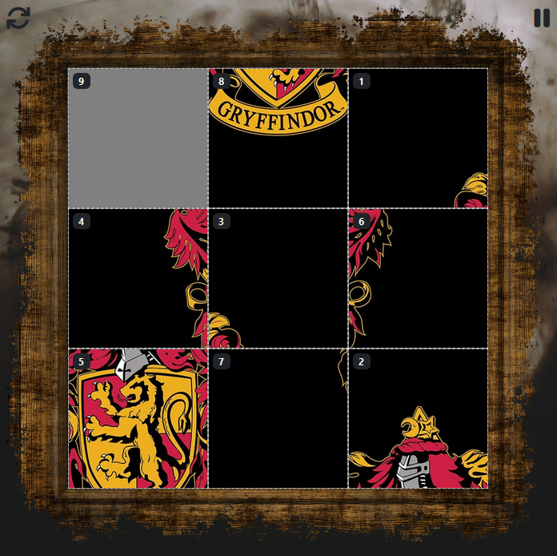
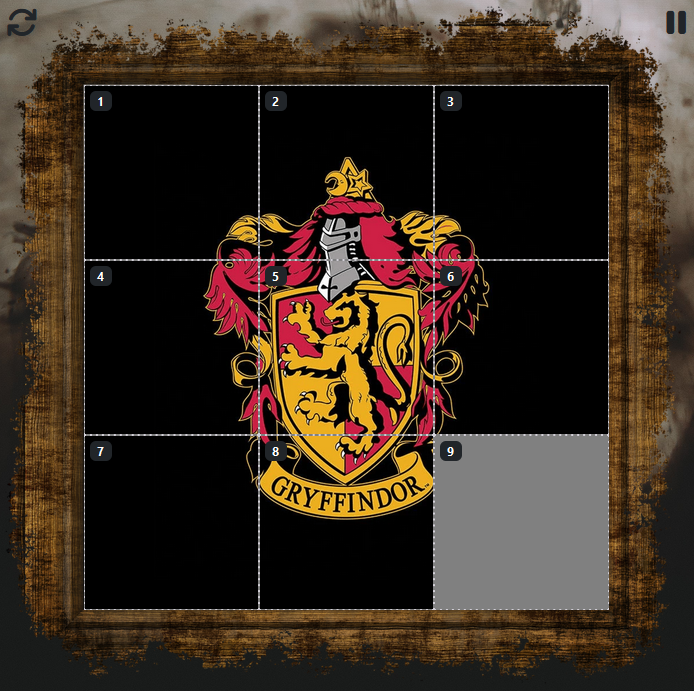
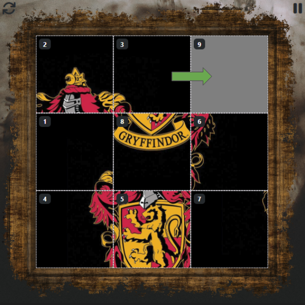
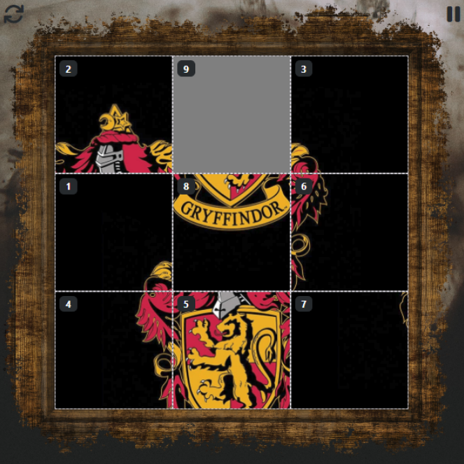

# **Revelio**

## A "Wizarding World" themed sliding puzzle game
 

> The [**Revelio Charm**](https://harrypotter.fandom.com/wiki/Revelio_Charm) is used to reveal concealed objects, messages, invisible things, and passages or any other secretly written messages and hidden markings.

 

# About

Sliding puzzles are a form of combination puzzles which requires the player to move puzzle pieces on a 2-dimensional plane to establish a certain final configuration. 

Typically the final configuration is established with the bottom-right piece of the puzzle missing.

 

> Fun fact: These puzzles are also sometimes known as *'8-puzzles'* or *'15-puzzles'*, since they are usually a square grid [e.g. (3x3) or (4x4)] with the last tile missing.

 

# How to play

The game is played by clicking on tiles adjacent to the empty space 

 

# Difficulty levels

There are 3 difficulty levels to select from: WOMBAT, OWL and NEWT.
<table>
  <thead>
    <tr>
      <th scope="col">Difficulty</th>
      <th scope="col">Last tile puzzle</th>
      <th scope="col">Show tile sequence</th>
    </tr>
  </thead>
  <tbody>
    <tr>
      <td>
          
🐨 W.O.M.B.A.T

          Wizards' Ordinary Magic and Basic Aptitude Test
      </td>
      <td>✔️</td>
      <td>✔️</td>
    </tr>
    <tr>
      <td>
          
🦉 O.W.L.

          Ordinary Wizarding Level
      </td>
      <td>❌</td>
      <td>✔️</td>
    </tr>
    <tr>
      <td>
          
🦎 N.E.W.T.

          Nastily Exhausting Wizarding Test
      </td>
      <td>❌</td>
      <td>❌</td>
    </tr>
  </tbody>
</table>

## WOMBAT (easy)
✔️ Last tile puzzle: 
> missing tile is the bottom-right tile

✔️ Show tile sequence:
> tile sequence is provided in the top-left corner

 

## OWL (medium)
❌ Last tile puzzle: 
> missing tile is randomised

✔️ Show tile sequence:
> tile sequence is provided in the top-left corner

 

## NEWT (hard)
❌ Last tile puzzle: 
> missing tile is randomised

❌ Show tile sequence:
> tile sequence is not provided

 

# Project goals

Task | Completion | Date | Remarks
------------ | ------------- | ------------- | -------------
3x3 grid | [x] | 10-Jun | -
swappable tiles | [x] | 10-Jun | tilecontent is swapped
variable grid size | [x] | 10-Jun | -
shuffle grid | [x] | 10-Jun | shuffle from initial complete board
randomise missing tile | [x] | 10-Jun | toggle on/off
grid completion | [x] | 10-Jun | -
variable frame size | [x] | 12-Jun | -
tile with images | [x] | 13-Jun | using canvas to crop original image
game screen layout | [x] | 14-Jun | -
toggle image sequence | [x] | 14-Jun | -
difficulty info and selection | [x] | 15-Jun | bootstrap modals
move no. tracking | [x] | 15-Jun | -
time tracking | [x] | 15-Jun | timer.js
highscores retrieval | [x] | 17-Jun | bootstrap offcanvas, supabase: fetch data
play/pause/reset | [x] | 21-Jun | -
highscore submissions | [x] | 22-Jun | supabase: insert data, scorer.js
responsive layout | [x] | 22-Jun | -
favicon | [x] | 22-Jun | tab icon
puzzle loader | [x] | 22-Jun | setTimeout
selection screen layout | [ ] | -
grid size selection | [ ] | -
image selection | [ ] | -